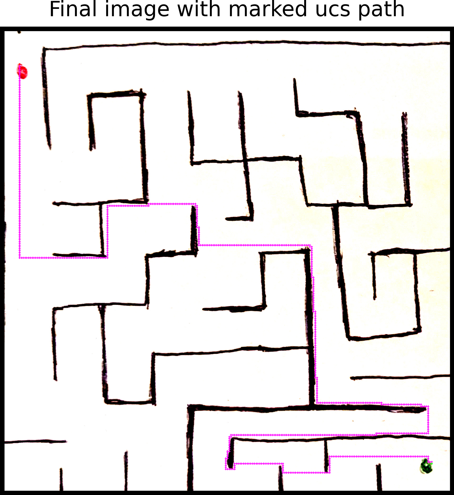

<h1>Pathfinding Mazesolver</h1>

<h3>A pathfinding program that utilises various algorithms to find the shortest path from point A (red) to point B (green) in a complex, defined maze</h3>

## Key Features

* Image processing
* Algorithm selection
  - Choice of using Uniform Cost Search (UCS) algorithm or A* algorithm with heuristic options between Manhattan and Euclidean distance
* Visual representation
  - Witness a bright, defined magenta patterned line solving the maze
* Solved image saving
* Effective colour identification

## How To Use
<h4>Clone this repository</h4>
$ git clone https://github.com/bylan1/pathfinding_mazesolver

<h4>Go into the repository</h4>
$ cd pathfinding_mazesolver

<h4>Paste your maze image into the paths folder</h4>

<h4>Run the app</h4>
$ python mazesolver.py [filename] [algorithm] [heuristic]

 

Where <b>filename</b> is the image stored in paths, <b>algorithm</b> is one of the following algorithms:

- astar (A* algorithm)
- ucs (Uniform Cost Search algorithm)

and <b>heuristic</b> is only necessary for astar and could be one of the following:

- manhattan
- euclidean

## Solved Maze Display

## Further Development
- Further optimise pathfinding algorithms
- Optimise maze wall definition
- More user-friendly input handling
- Explore more algorithm options
- Test and adapt with unique photo image cases
